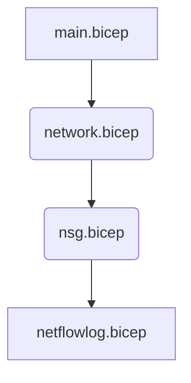

# Conflicts

## Vnet Peers

When creating two vnets that need to be peered, you have to create a peering at each end.
However when you do this without any explicit sequencing, both peers will be created simultaneously which causes a conflict.

Explicit sequencing of the peers is required;

```bicep
module vnet1peering 'vnetpeer.bicep' = {
  name: 'peer-vnet-grid-${resourceName}'
  scope: gridRg
  params: {
    vnet1Name: gridVnet.outputs.vnetName
    vnet2ResourceId: appVnet.outputs.vnetId
    peeringName: 'peer-${gridVnet.outputs.vnetName}-${appVnet.outputs.vnetName}'
  }
}

module vnet2peering 'vnetpeer.bicep' = {
  name: 'peer-vnet-grid-${resourceName}'
  scope: appRg
  params: {
    vnet1Name: appVnet.outputs.vnetName
    vnet2ResourceId: gridVnet.outputs.vnetId
    peeringName: 'peer-${appVnet.outputs.vnetName}-${gridVnet.outputs.vnetName}'
  }
  dependsOn: [
    vnet1peering //we can't create 2 peers at the same time at each end - we must manually sequence them
  ]
}
```

## NSG Flow Logs

If multiple NSG's are trying to add flow logs at the same, this will result in CONFLICT: AnotherOperationInProgress
Therefore advised to create FlowLogs outside of NSG creation, to better coordinate the creation

Given the scenario of this bicep structure, conflicts will be encountered



### The solution

The NetFlow Logs creation needs to be sequenced, so the module that creates the NSG's should be responsible.

There's 2 options in how to implement this.

1. Pull the logic of the creation to the higher module to create in a controlled array-sequence. This will usually be the best way, but if the array is conditional/dynamic it can lead to a lot of added complexity.
1. Sequence the creation of the NSG creation

In the [AKS-Construction project](https://github.com/Azure/AKS-Construction/tree/main/bicep) i went with option 2, keeping the flow log creation in the NSG and sequencing the NSG creation in the calling modules.
