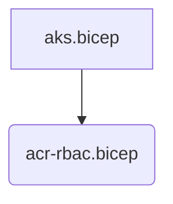

# Scopes

When you consider that bicep code will generally be deployed at the resource group level you can see why the bicep linter will complain so heavily when you're trying to add resources across many resource groups in one file.

**One** file will target **one** resource group. Therefore it's important to modularise your code when your deployment **could** span resource groups.

One of the best examples is when one resource needs RBAC permission to access another resource, and where should this code live.

## Example - Adding RBAC to ACR for AKS

Two resources are at play in this example.

1. Azure Container Registry
1. Azure Kubernetes Service

The ACR will be leveraged across **many AKS clusters**, and therefore will reside in it's **own Resource Group**. This means that when we need to add the RBAC for AKS, we need to do it in a manner that works with the resource group scopes.



AKS.bicep operates at the AKS scope, and calls ACR-RBAC providing the scope of the ACR Resource Group.

```bicep
//--------ACR RBAC Assignment for new AKS cluster--------
param acrName string
param acrRg string

module acrRbac 'acr-rbac.bicep' = {
  name: 'acr-rbac-for-aks'
  scope: resourceGroup(acrRg)
  params: {
    acrName: acrName
    aksName: aksconst.outputs.aksClusterName
    aksResourceGroup: resourceGroup().name
  }
}

module aksconst '../../bicep/main.bicep' = {...
```

> For the full example of this scenario, refer to the [Shared ACR sample in AKS Construction](https://github.com/Azure/AKS-Construction/blob/main/samples/shared-acr/main.bicep)